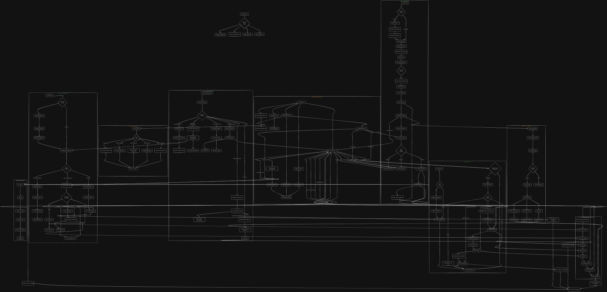

# **NutriDeliver - Multi-Application Architecture**


NutriDeliver is a complete  solution for a healthy food delivery ecosystem, supporting customers, restaurants, delivery riders, and administrators. The platform enables users to browse nutritious meals, place orders, manage carts, and track deliveries in real time. Restaurants can manage menus, orders, and analytics, while riders handle deliveries with live location updates and earnings tracking. The system includes secure authentication, payment processing, notifications, offers, and full platform oversight for admins—all built with a scalable, modular, and secure architecture.


---




## **1. CUSTOMER APP (End Users)**

### **Primary Flow:**
```
Launch → Login/Register → Browse → Add to Cart → Checkout → Track → Rate
```

### **Required Screens:**

#### **A. Authentication (4 Screens)**
1. **Login Screen** - Email/Password + Social login
2. **Registration Screen** - Customer details collection
3. **OTP Verification** - Email/Phone verification
4. **Forgot Password** - Reset password flow

#### **B. Discovery & Browsing (6 Screens)**
5. **Home Screen** - Featured restaurants, categories, search bar
6. **Restaurant List Screen** - Filterable list (rating, dietary, distance)
7. **Restaurant Detail Screen** - Info, rating, menu categories
8. **Menu Screen** - Food items with dietary tags (vegetarian, keto, etc.)
9. **Food Detail Screen** - Full nutritional info, ingredients, preparation time
10. **Search Screen** - Advanced filters (dietary needs, price range, calories)

#### **C. Order Management (7 Screens)**
11. **Cart Screen** - Items with total, restaurant-specific cart
12. **Checkout Screen** - Address selection, payment method, order summary
13. **Payment Screen** - Stripe integration, card details
14. **Order Confirmation** - Order ID, estimated time
15. **Live Tracking Screen** - Map view, rider location, ETA
16. **Order History Screen** - Past orders with status
17. **Order Detail Screen** - Full order breakdown, reorder option

#### **D. Account & Support (5 Screens)**
18. **Profile Screen** - Personal info, dietary preferences
19. **Address Management** - Saved addresses
20. **Favorites Screen** - Saved restaurants/items
21. **Notifications Screen** - Push + in-app notifications
22. **Support/Help Center**

### **Customer App APIs Required:**

#### **Authentication**
- `POST /api/auth/customer/login`
- `POST /api/auth/customer/register`
- `POST /api/auth/refresh-token`
- `POST /api/auth/logout`

#### **Restaurant & Menu**
- `GET /api/restaurants` (with pagination, filters)
- `GET /api/restaurants/:id`
- `GET /api/categories` (healthy food categorization)
- `GET /api/foods` (filter by restaurant/category)
- `GET /api/foods/:id` (with nutritional metadata)

#### **Cart & Order**
- `POST /api/cart/add` (restaurant-specific cart)
- `GET /api/cart`
- `DELETE /api/cart/item/:id`
- `POST /api/orders/create`
- `GET /api/orders` (customer's orders)
- `GET /api/orders/:id`
- `GET /api/orders/:id/track` (real-time tracking)
- `POST /api/orders/:id/cancel`

#### **Payment**
- `POST /api/payments/create-intent` (Stripe)
- `POST /api/payments/confirm`

#### **User Management**
- `PUT /api/customers/profile`
- `GET /api/customers/addresses`
- `POST /api/customers/addresses`
- `GET /api/customers/favorites`
- `POST /api/restaurants/:id/favorite`

#### **Notifications**
- `GET /api/notifications`
- `PUT /api/notifications/:id/read`

#### **Ratings & Feedback**
- `POST /api/orders/:id/rate` (rate restaurant/rider/food)
- `POST /api/restaurants/:id/review`

---

## **2. RESTAURANT APP (Restaurant Owners/Managers)**

### **Primary Flow:**
```
Login → Dashboard → Manage Menu → Handle Orders → Update Status → View Analytics
```

### **Required Screens:**

#### **A. Authentication (2 Screens)**
1. **Restaurant Login** - Restaurant-specific credentials
2. **Setup Screen** - Initial restaurant configuration

#### **B. Dashboard & Orders (6 Screens)**
3. **Main Dashboard** - Today's stats, pending orders
4. **Active Orders Screen** - Live orders with status
5. **Order Detail Screen** - Order items, special instructions
6. **Order History Screen** - Past orders with filtering
7. **Order Status Update** - Accept/Ready/Picked up
8. **Preparation Timer** - For each order

#### **C. Menu Management (4 Screens)**
9. **Menu Overview** - All categories and items
10. **Category Management** - Add/edit food categories
11. **Food Item Management** - Add/edit with nutritional data
12. **Inventory Management** - Stock levels, availability toggle

#### **D. Operations & Analytics (5 Screens)**
13. **Analytics Dashboard** - Sales, popular items, peak hours
14. **Earnings Screen** - Daily/weekly/monthly earnings
15. **Restaurant Profile** - Operating hours, description, images
16. **Notification Center** - New orders, system alerts
17. **Support/Help**

### **Restaurant App APIs Required:**

#### **Authentication**
- `POST /api/auth/restaurant/login`
- `GET /api/auth/restaurant/profile`

#### **Orders Management**
- `GET /api/restaurant/orders` (filter by status)
- `GET /api/restaurant/orders/:id`
- `PUT /api/orders/:id/status` (accept → preparing → ready)
- `POST /api/orders/:id/preparation-time`

#### **Menu Management**
- `GET /api/restaurant/menu`
- `POST /api/restaurant/menu/categories`
- `POST /api/restaurant/menu/items`
- `PUT /api/restaurant/menu/items/:id`
- `DELETE /api/restaurant/menu/items/:id`
- `PUT /api/restaurant/menu/availability` (toggle items)

#### **Analytics & Earnings**
- `GET /api/restaurant/analytics/daily`
- `GET /api/restaurant/analytics/weekly`
- `GET /api/restaurant/earnings`
- `GET /api/restaurant/popular-items`

#### **Restaurant Profile**
- `PUT /api/restaurant/profile`
- `POST /api/restaurant/upload-image` (Cloudinary)
- `PUT /api/restaurant/operating-hours`

#### **Notifications**
- `GET /api/restaurant/notifications`
- `WS /restaurant-orders` (WebSocket for real-time orders)

---

## ** 3. RIDER APP (Delivery Personnel)**

### **Primary Flow:**
```
Login → Go Online → Receive Orders → Accept → Navigate → Pickup → Deliver → Confirm
```

### **Required Screens:**

#### **A. Authentication (2 Screens)**
1. **Rider Login** - Rider-specific credentials
2. **Document Upload** - Initial setup (vehicle docs, license)

#### **B. Order Management (6 Screens)**
3. **Rider Dashboard** - Current status, earnings summary
4. **Available Orders Screen** - List of nearby orders
5. **Order Detail Screen** - Pickup/delivery addresses, customer notes
6. **Navigation Screen** - Integrated maps to location
7. **Order Actions Screen** - Pickup confirm, delivery confirm
8. **Active Delivery Screen** - Current order with customer contact

#### **C. Earnings & Performance (4 Screens)**
9. **Earnings Dashboard** - Today's/week's earnings
10. **Earnings History** - Detailed breakdown per order
11. **Performance Metrics** - Ratings, on-time deliveries
12. **Payouts Screen** - Payment history, next payout

#### **D. Profile & Support (4 Screens)**
13. **Rider Profile** - Personal info, vehicle details
14. **Availability Toggle** - Go online/offline
15. **Documents Screen** - Uploaded docs status
16. **Support/Chat** - Contact admin/support

### **Rider App APIs Required:**

#### **Authentication**
- `POST /api/auth/rider/login`
- `POST /api/auth/rider/register` (with document upload)

#### **Order Management**
- `GET /api/rider/available-orders`
- `POST /api/orders/:id/accept`
- `POST /api/orders/:id/reject`
- `POST /api/orders/:id/picked-up`
- `POST /api/orders/:id/delivered`
- `GET /api/rider/current-order`

#### **Location & Tracking**
- `POST /api/rider/location/update` (real-time location)
- `POST /api/rider/availability` (toggle online/offline)
- `GET /api/orders/:id/tracking-info` (customer details)

#### **Earnings & Performance**
- `GET /api/rider/earnings/today`
- `GET /api/rider/earnings/history`
- `GET /api/rider/performance`
- `GET /api/rider/payouts`

#### **Profile Management**
- `GET /api/rider/profile`
- `PUT /api/rider/profile`
- `POST /api/rider/documents` (upload)
- `GET /api/rider/documents/status`

#### **Real-time Communication**
- `WS /rider-orders` (WebSocket for new orders)
- `POST /api/notifications/rider-push` (push notifications)

---

## **4. ADMIN WEB PANEL (Platform Administrators)**

### **Primary Flow:**
```
Login → Dashboard → Manage Users → Monitor Orders → Handle Verification → View Analytics
```

### **Required Modules/Screens:**

#### **A. Dashboard (1 Screen)**
1. **Admin Dashboard** - Platform overview, KPI cards, charts

#### **B. User Management (3 Screens)**
2. **Users Overview** - All users (customers/restaurants/riders)
3. **User Detail Screen** - Full profile, activity, orders
4. **User Verification** - Approve/reject restaurants & riders

#### **C. Restaurant Management (3 Screens)**
5. **Restaurants List** - All restaurants with status
6. **Restaurant Detail** - Full info, documents, menu
7. **Restaurant Approval** - Verify documents, approve listing

#### **D. Order Management (2 Screens)**
8. **All Orders** - Filterable orders table
9. **Order Intervention** - Cancel/refund/problem resolution

#### **E. Rider Management (3 Screens)**
10. **Riders List** - All riders with status
11. **Rider Verification** - Document approval
12. **Rider Performance** - Ratings, completion rate

#### **F. Content & Platform (4 Screens)**
13. **Categories Management** - Food categories
14. **Offers/Promotions** - Create/edit platform-wide offers
15. **System Settings** - Platform config, fees, commission
16. **Content Management** - Homepage banners, notifications

#### **G. Analytics & Reports (3 Screens)**
17. **Financial Reports** - Revenue, commissions, payouts
18. **Platform Analytics** - User growth, order trends
19. **Export Data** - Generate reports

#### **H. Support & Monitoring (2 Screens)**
20. **Support Tickets** - Customer/restaurant issues
21. **System Logs** - API logs, error monitoring

### **Admin Panel APIs Required:**

#### **Dashboard**
- `GET /api/admin/dashboard/stats`
- `GET /api/admin/dashboard/analytics`

#### **User Management**
- `GET /api/admin/users` (all roles)
- `GET /api/admin/users/:id`
- `PUT /api/admin/users/:id/status` (suspend/activate)
- `DELETE /api/admin/users/:id`

#### **Restaurant Management**
- `GET /api/admin/restaurants`
- `GET /api/admin/restaurants/:id`
- `POST /api/admin/restaurants/:id/verify`
- `PUT /api/admin/restaurants/:id/commission`

#### **Rider Management**
- `GET /api/admin/riders`
- `GET /api/admin/riders/:id`
- `POST /api/admin/riders/:id/verify`
- `PUT /api/admin/riders/:id/status`

#### **Order Management**
- `GET /api/admin/orders`
- `GET /api/admin/orders/:id`
- `POST /api/admin/orders/:id/intervene`
- `POST /api/admin/orders/:id/refund`

#### **Platform Management**
- `GET /api/admin/categories`
- `POST /api/admin/categories`
- `GET /api/admin/offers`
- `POST /api/admin/offers`
- `PUT /api/admin/settings`
- `GET /api/admin/system/logs`

#### **Reports & Analytics**
- `GET /api/admin/reports/financial`
- `GET /api/admin/reports/users`
- `GET /api/admin/reports/orders`
- `POST /api/admin/reports/export`

---

## **COMMON FLOWS ACROSS APPLICATIONS**

### **Authentication Flow (All Apps):**
```
Launch App → Check Token → If valid → Direct to Dashboard
                ↓ If invalid/expired
           Show Login → Credentials → API Call → Store Tokens → Dashboard
```

### **Order Lifecycle Flow:**
```
Customer: Place Order → Payment → Confirmation → Track → Rate
Restaurant: Receive → Accept → Prepare → Mark Ready
Rider: See Available → Accept → Navigate → Pickup → Deliver → Confirm
Admin: Monitor → Intervene if needed
```

### **Notification Flow:**
```
Event Trigger → Backend Processing → Push Notification → In-App Update
(Order status changes, new orders, payment confirmation, etc.)
```

---

## **CROSS-APP API DEPENDENCIES**

### **Shared APIs:**
- All: `POST /api/auth/login` (role-specific)
- All: `POST /api/auth/logout`
- All: `POST /api/auth/refresh-token`
- All: `GET /api/notifications`
- Customer/Rider: `POST /api/upload` (Cloudinary)

### **Role-Specific API Access:**
- **Customer Only:** Cart, Favorites, Order creation
- **Restaurant Only:** Menu management, Order status updates
- **Rider Only:** Order acceptance, Location updates
- **Admin Only:** User management, Platform settings

---

## **DATA SYNC REQUIREMENTS**

### **Real-time Updates Needed:**
1. **Order Status** (Customer, Restaurant, Rider, Admin)
2. **Rider Location** (Customer, Admin)
3. **New Orders** (Restaurant, Rider)
4. **Availability Status** (Rider → Customer/Restaurant)

### **WebSocket Channels:**
- `customer-{userId}` - Order updates
- `restaurant-{restaurantId}` - New orders, updates
- `rider-{riderId}` - Order assignments
- `admin` - System-wide notifications

---

#### **Industrial Application Design, feel free to fork and use it as a reference for your own projects.**

Sharing is caring until someone findout...

## Happy Coding... :)
